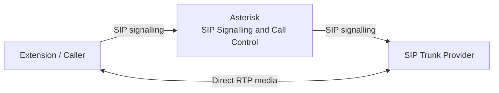

# VoIP Media Bypass Optimisation

## RTP Media Offloading and Infrastructure Resource Optimisation

**Author:** Mohammad Sorower Jahan  
**Organisation:** Tech News 365 IT Institute, Bangladesh  
**Role:** Senior Lecturer & IT Research and Innovation Lead  
**Employment period:** 5 January 2015 – 30 December 2021  
**Engineering Area:** VoIP, SIP, RTP, Asterisk, Telecommunications Infrastructure and Systems Optimisation

---

## Project Overview

This repository documents a VoIP engineering project I carried out during my time at Tech News 365 IT Institute.

The work focused on a common infrastructure problem in SIP-based telecommunications systems: keeping the central Asterisk server unnecessarily involved in the RTP media path after a call had already been established.

In the original arrangement, Asterisk handled both:

- SIP signalling and call control
- RTP media passing between the caller and the SIP trunk provider

The logical path was:

```text
Extension / Caller
        |
        | SIP signalling
        | RTP media
        v
     Asterisk
        |
        | SIP signalling
        | RTP media
        v
 SIP Trunk Provider
```

This meant that every active call placed additional traffic and media-processing load on the Asterisk server.

I redesigned the call architecture so that Asterisk remained responsible for SIP signalling and call control while, where the connected endpoints and network conditions permitted it, RTP media was allowed to flow directly between the caller side and the SIP trunk provider.

The resulting logical design was:

```text
                    SIP Signalling
Extension / Caller --------------------> Asterisk
       ^                                   |
       |                                   |
       |                                   | SIP Signalling
       |                                   v
       +========= RTP Media ========= SIP Trunk Provider
```

The objective was not to remove Asterisk from the call.

Asterisk continued to control call establishment, SIP negotiation and call termination.

The optimisation removed the central server from the continuous RTP media path where direct media was technically possible.

---

## The Engineering Problem

A traditional SIP call through an intermediary can involve two separate functions:

1. SIP signalling
2. RTP media transport

These functions do not always need to follow the same network path.

Before optimisation, the effective architecture was:

```text
Caller
  |
  | SIP
  | RTP
  v
Asterisk
  |
  | SIP
  | RTP
  v
SIP Trunk Provider
```

Asterisk therefore had to receive RTP packets from one side and send them towards the other side for the duration of every active call.

With increasing call concurrency, this placed additional demand on:

- CPU
- system memory
- network interfaces
- packet-processing capacity
- server bandwidth

The engineering question was:

**Could Asterisk continue controlling the SIP session while allowing RTP to follow a more direct path between the call endpoints?**

---

## Design Principle

The optimisation separated the signalling plane from the media plane.

### Signalling plane

Asterisk remained responsible for SIP signalling.

The logical signalling path remained:

```text
Extension / Caller
        |
       SIP
        |
        v
     Asterisk
        |
       SIP
        |
        v
 SIP Trunk Provider
```

### Media plane

Where direct media negotiation was possible, RTP was allowed to flow directly between the caller side and the SIP trunk provider.

```text
Extension / Caller
        |
        |
       RTP
        |
        v
 SIP Trunk Provider
```

This meant that Asterisk no longer needed to relay every RTP packet for those calls.

---

## High-Level Architecture



The important architectural point is that signalling and media followed different logical paths.

---

## Before Optimisation

Before the media-path change, Asterisk remained in both the signalling and RTP paths.

```text
                   SIP + RTP
Extension / Caller -----------> Asterisk
                                   |
                                   |
                                   | SIP + RTP
                                   v
                            SIP Trunk Provider
```

For each active call, RTP traffic had to:

1. arrive at the Asterisk server
2. be processed by the server
3. leave the server towards the opposite call leg

The reverse RTP stream followed the corresponding path back through Asterisk.

---

## After Optimisation

After optimisation, Asterisk remained in the SIP signalling path but no longer had to remain in the continuous RTP media path where direct media was successfully negotiated.

```text
SIP signalling:

Extension / Caller
        |
        v
     Asterisk
        |
        v
 SIP Trunk Provider


RTP media:

Extension / Caller
        |
        | direct RTP
        |
        v
 SIP Trunk Provider
```

The result was a separation between:

```text
Call control
```

and:

```text
Media transport
```

---

## Asterisk's Role After Optimisation

Asterisk remained an important part of the architecture.

It continued to handle functions including:

- SIP call establishment
- destination selection
- call routing
- SIP negotiation
- call-state management
- call termination
- dialplan processing

The optimisation therefore did not mean:

```text
Remove Asterisk
```

It meant:

```text
Keep Asterisk for signalling and call control,
but avoid unnecessary RTP relaying.
```

---

## RTP Media Bypass

The main optimisation was media bypass.

Instead of:

```text
Caller
  |
 RTP
  v
Asterisk
  |
 RTP
  v
Provider
```

the preferred media path became:

```text
Caller
  |
 RTP
  v
Provider
```

while SIP signalling still passed through Asterisk.

This reduced the amount of continuous packet traffic handled by the central server.

---

## Why Media Bypass Matters

RTP traffic is continuous during active voice communication.

SIP signalling, by comparison, is relatively intermittent.

SIP messages are primarily exchanged during events such as:

- call establishment
- negotiation
- call modification
- call termination

RTP packets are exchanged continually while media is active.

For this reason, removing unnecessary RTP relaying can have a much larger effect on server traffic than merely reducing SIP signalling.

---

## Server Resource Impact

When Asterisk remains in the media path, every call creates traffic in both directions through the server.

Conceptually:

```text
Caller RTP
    |
    v
Asterisk
    |
    v
Provider RTP
```

and:

```text
Provider RTP
    |
    v
Asterisk
    |
    v
Caller RTP
```

The central system therefore handles both directions of every active media session.

With media bypass:

```text
Caller <====== RTP ======> Provider
```

Asterisk can remain responsible for signalling without continuously forwarding the RTP stream.

---

## Observed Result

During the project, the media-bypass architecture produced an observed reduction of approximately:

**50% in overall central-server resource and media-path load**

in the tested environment.

The improvement was observed across areas including:

- CPU utilisation
- memory utilisation
- server-side bandwidth usage

The approximately 50% figure should be understood as an overall engineering observation from the project environment.

It was not a controlled laboratory benchmark establishing exactly 50% reduction independently for CPU, RAM and bandwidth.

The exact historical monitoring output is no longer available.

---

## Test Scale

The architecture was tested with:

**more than 100 simultaneous calls**

This was important because the benefits of removing unnecessary media relay become more significant as the number of concurrent RTP sessions increases.

With only a small number of calls, the difference in server load may be modest.

With larger concurrent call volumes, the aggregate packet-processing and bandwidth demand becomes much more significant.

---

## Simplified Traffic Example

Consider 100 simultaneous calls.

With Asterisk remaining in the RTP path:

```text
100 incoming media streams
          +
100 corresponding outgoing media streams
          |
          v
      Asterisk
```

The server is continuously involved in the media movement for every call.

With direct media:

```text
Caller endpoints
       |
       | RTP
       v
SIP trunk/provider media endpoints
```

Asterisk continues to process signalling but does not need to relay the complete RTP payload for each eligible call.

This example illustrates the architecture rather than providing a precise bandwidth calculation.

---

## CPU Impact

RTP relay creates continuous packet-processing activity.

For large numbers of calls, the server must repeatedly:

- receive packets
- process media-related session state
- transfer packets
- maintain socket activity

Removing the server from the media path reduces this work where media bypass is possible.

The practical benefit depends on factors such as:

- number of simultaneous calls
- codec
- packetisation
- operating system
- network interface capacity
- Asterisk configuration
- endpoint behaviour

---

## Memory Impact

Active media sessions also require runtime resources.

Asterisk must maintain call and media-related state for active sessions.

Media bypass does not remove all call state because Asterisk remains responsible for call control.

However, reducing the amount of active media handling can reduce some of the resource pressure associated with carrying large volumes of RTP traffic through the server.

In the project environment, memory utilisation was observed to improve as part of the overall optimisation.

---

## Bandwidth Impact

The bandwidth benefit is easier to understand by examining the path.

### Before

```text
Caller
   |
   | RTP
   v
Asterisk
   |
   | RTP
   v
Provider
```

Asterisk's network interface must handle the media entering and leaving the server.

### After

```text
Caller
   |
   | RTP
   v
Provider
```

The central Asterisk interface does not carry the full continuous media stream for calls successfully using direct media.

The media still consumes network bandwidth between the endpoints.

The optimisation reduces bandwidth passing through the central Asterisk server rather than eliminating RTP bandwidth from the network.

---

## Important Distinction

Media bypass does **not** mean that voice traffic no longer consumes bandwidth.

The RTP stream still exists.

The difference is where it travels.

Before:

```text
Endpoint -> Asterisk -> Provider
```

After:

```text
Endpoint -> Provider
```

Therefore, the optimisation primarily reduces:

- central-server network traffic
- unnecessary media relay
- central packet-processing workload

rather than reducing the codec's inherent media bitrate.

---

## SIP Signalling Remains Centralised

Asterisk remained in control of the SIP call.

The signalling architecture continued to allow Asterisk to perform call-routing and control functions.

Conceptually:

```text
           SIP
Caller ------------> Asterisk
                       |
                       | SIP
                       v
                    Provider
```

while simultaneously:

```text
Caller <========== RTP ==========> Provider
```

This separation was central to the engineering design.

---

## Call Establishment

A simplified call establishment sequence was:

```text
1. Caller initiates a SIP call.

2. Asterisk receives the SIP signalling.

3. Asterisk processes the dialplan and destination.

4. Asterisk establishes the SIP leg towards the trunk provider.

5. SIP/SDP negotiation establishes the media parameters.

6. Where network and endpoint conditions permit,
   RTP is allowed to flow directly between the media endpoints.

7. Asterisk remains responsible for the SIP call state.

8. When the call ends, Asterisk processes the SIP termination.
```

This kept call control centralised while optimising continuous media transport.

---

## Network Requirements

Direct media cannot be assumed to work in every network.

The endpoints involved must be able to exchange RTP directly.

Potential limitations include:

- NAT
- firewall policy
- private addressing
- provider configuration
- SDP addressing
- endpoint capability
- asymmetric routing
- security policy

Where direct connectivity is not possible, the media path may still need an intermediary.

The project therefore treated media bypass as an architecture to use where the network conditions supported it.

---

## NAT Considerations

NAT can prevent two media endpoints from reaching each other directly.

A successful media-bypass design must consider the addresses advertised through SIP/SDP and whether those addresses are reachable from the opposite endpoint.

Depending on the network topology, a system may require:

- appropriate NAT handling
- firewall rules
- public addressing
- correctly advertised media addresses
- provider-side compatibility

The exact historical NAT and firewall configuration from this project is no longer available.

---

## Codec Considerations

The purpose of the project was media-path optimisation rather than codec conversion.

Media bypass is particularly valuable where both sides can negotiate compatible media parameters without requiring Asterisk to transcode between codecs.

If transcoding is required, Asterisk may need to remain in the media path.

The practical ability to bypass media therefore depends on successful codec negotiation as well as network reachability.

---

## Conditions Where Asterisk May Need to Remain in the Media Path

Direct RTP is not appropriate for every call.

Asterisk may need to remain in the media path where functions such as the following are required:

- transcoding
- recording
- conferencing
- media manipulation
- certain DTMF handling
- media monitoring
- incompatible endpoint addressing
- NAT traversal requiring relay
- other media-dependent applications

The optimisation therefore involved allowing media bypass where it was appropriate rather than forcing every possible call into a direct-media architecture.

---

## Engineering Approach

The project involved analysing the relationship between SIP signalling and RTP media rather than treating them as a single inseparable path.

The engineering process included:

- examining the existing Asterisk call path
- identifying unnecessary RTP relay
- separating signalling requirements from media requirements
- testing direct media behaviour
- validating call establishment
- validating bidirectional audio
- testing SIP termination
- observing server resource utilisation
- exercising the architecture with more than 100 simultaneous calls
- comparing central-server load before and after optimisation

---

## Technical Components

| Component | Role |
|---|---|
| Asterisk | SIP signalling, routing and call control |
| SIP | Call establishment and signalling |
| SDP | Media negotiation |
| RTP | Voice media transport |
| SIP trunk provider | External telecommunications connectivity |
| Extensions / callers | Originating VoIP endpoints |
| Linux infrastructure | Server operating environment |

---

## Engineering Result

The central engineering result was the separation of:

```text
SIP signalling
```

from:

```text
RTP media transport
```

Asterisk continued to provide the required call-control functions while eligible RTP streams were allowed to take a more direct end-to-end path.

This reduced unnecessary media handling by the central VoIP server.

In the test environment, the change was associated with an approximately 50% overall reduction in central-server resource and media-path load.

---

## Scalability Significance

Media relay becomes increasingly expensive as call concurrency grows.

The server may be able to handle the signalling load for a large number of calls while the corresponding RTP traffic places substantially greater demand on its network and processing resources.

By removing unnecessary RTP relay, the architecture allowed server resources to be concentrated on functions that actually required central processing.

This was particularly relevant when testing at more than 100 simultaneous calls.

---

## Before and After

### Before optimisation

```text
SIGNALLING

Extension
   |
   v
Asterisk
   |
   v
SIP Trunk Provider


MEDIA

Extension
   |
   v
Asterisk
   |
   v
SIP Trunk Provider
```

### After optimisation

```text
SIGNALLING

Extension
   |
   v
Asterisk
   |
   v
SIP Trunk Provider


MEDIA

Extension
   |
   +==========================+
                              |
                              v
                     SIP Trunk Provider
```

The SIP architecture remained centralised.

The media architecture became direct where technically possible.

---

## What the Project Demonstrates

The project illustrates an important VoIP engineering principle:

**The SIP signalling path and RTP media path do not necessarily need to be identical.**

Separating the two can allow the telecommunications platform to maintain central call control while reducing unnecessary media-processing load.

The architecture is useful particularly where:

- endpoints can reach one another directly
- the same or compatible codecs can be negotiated
- central media services are not required
- network policy allows direct RTP

---

## What the Project Does Not Claim

This project does not claim that:

- media bypass is appropriate for every VoIP deployment
- Asterisk should always be removed from the RTP path
- every system will achieve a 50% reduction
- CPU utilisation will always decrease by exactly 50%
- memory utilisation will always decrease by exactly 50%
- network bandwidth will always decrease by exactly 50%
- RTP bandwidth itself disappears
- direct media will work through every NAT or firewall environment

The approximately 50% figure represents the overall improvement observed in the original project environment.

---

## Historical Context

This work was carried out during my employment at:

**Tech News 365 IT Institute, Bangladesh**

where I worked as:

**Senior Lecturer & IT Research and Innovation Lead**

from:

**5 January 2015 to 30 December 2021**

The media-bypass work formed part of my technical research and practical telecommunications engineering activities during that period.

This repository has been created later as a structured technical record of that work.

---

## Evidence Status

The repository is a retrospective technical reconstruction.

The original:

- server configurations
- Asterisk configuration files
- monitoring screenshots
- performance graphs
- packet captures
- project screenshots
- test logs

are no longer available.

The exact historical monitoring tool used for the resource measurements is also not recorded here because I do not want to reconstruct a detail that cannot now be established confidently.

For that reason, the approximately 50% improvement is documented as a historical engineering observation rather than an independently reproducible benchmark.

---

## Evidence Boundaries

Current diagrams and Markdown documentation in this repository were created to explain the earlier engineering work.

They should not be interpreted as documents or diagrams originally produced during the project period.

The repository does not represent reconstructed material as contemporaneous evidence.

Where external documentary or independent confirmation of the historical work is available, it should be considered separately from the technical reconstruction presented here.

---

## Documentation

Additional documentation will be maintained in the `docs` directory.

The repository is intended to include:

```text
voip-media-bypass-optimization/
│
├── README.md
│
└── docs/
    ├── architecture.md
    ├── media-flow.md
    ├── resource-analysis.md
    ├── scalability-testing.md
    └── project-evidence.md
```

These files will document the architecture and engineering reasoning in greater detail.

---

## Repository Purpose

The purpose of this repository is to document:

- the original media-relay problem
- the SIP and RTP architecture
- the media-bypass design
- the separation of signalling and media
- central-server resource implications
- high-concurrency testing
- project limitations
- evidence boundaries

It is intended as a technical engineering record rather than a universal Asterisk deployment guide.

---

## Author

**Mohammad Sorower Jahan**

**Role during the project:** Senior Lecturer & IT Research and Innovation Lead

Technical areas:

VoIP | SIP | RTP | Asterisk | Linux | Telecommunications Infrastructure | Network Architecture | Systems Optimisation

**GitHub:** [Core-daemon](https://github.com/Core-daemon)

**Website:** [www.msjahan.com](https://www.msjahan.com)

---

*This repository documents a practical VoIP media-path optimisation project. Resource improvements described here relate to the original project environment and should not be interpreted as universal performance benchmarks.*
