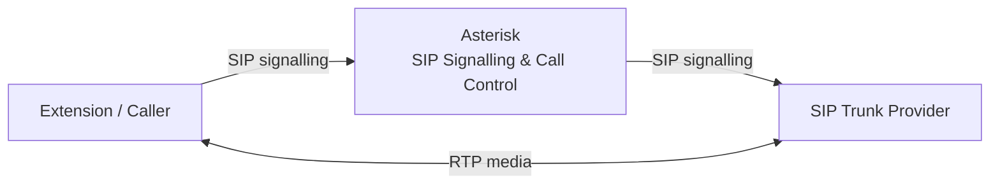

# Technical Architecture

## VoIP Media Bypass and RTP Offloading Design

**Author:** Mohammad Sorower Jahan  
**Organisation:** Tech News 365 IT Institute, Bangladesh  
**Role:** Senior Lecturer & IT Research and Innovation Lead  
**Employment period:** 5 January 2015 – 30 December 2021  
**Technology:** Asterisk, SIP, SDP and RTP

---

## 1. Architecture Overview

This project examined the relationship between SIP call control and RTP media transport in an Asterisk-based VoIP environment.

The original call architecture placed Asterisk in both the signalling path and the media path.

In simple terms:

```text
Extension / Caller
        |
        | SIP signalling
        | RTP media
        v
     Asterisk
        |
        | SIP signalling
        | RTP media
        v
 SIP Trunk Provider
```

This arrangement worked, but it meant that the central Asterisk server remained involved in every RTP packet throughout the duration of an active call.

As concurrent call volume increased, the continuous RTP traffic placed additional load on the central server.

The optimisation separated the signalling path from the media path.

---

## 2. Original Architecture

Before the optimisation, Asterisk handled both major parts of the call.

### SIP signalling

```text
Extension
    |
   SIP
    |
    v
Asterisk
    |
   SIP
    |
    v
SIP Trunk Provider
```

### RTP media

```text
Extension
    |
   RTP
    |
    v
Asterisk
    |
   RTP
    |
    v
SIP Trunk Provider
```

Asterisk therefore received and retransmitted the media associated with each active call.

---

## 3. Resource Implication of the Original Design

For every active call, Asterisk remained in the middle of the RTP stream.

A simplified bidirectional media relationship looked like:

```text
Extension
    |
    | RTP
    v
Asterisk
    |
    | RTP
    v
Provider


Provider
    |
    | RTP
    v
Asterisk
    |
    | RTP
    v
Extension
```

The central server therefore handled traffic in both directions.

As concurrent calls increased, this could increase demand on:

- CPU
- memory
- network interfaces
- packet-processing capacity
- operating-system networking resources

The project investigated whether this continuous media relay was necessary for calls where the two media endpoints could communicate directly.

---

## 4. Optimised Architecture

The redesigned architecture retained Asterisk for SIP signalling and call control.

The media path was separated where direct RTP communication was technically possible.

The resulting architecture was:

```text
                    SIP signalling
Extension / Caller --------------------> Asterisk
       ^                                   |
       |                                   |
       |                                   | SIP signalling
       |                                   v
       +========= RTP media ========= SIP Trunk Provider
```

Asterisk continued to establish and control the call.

However, the RTP media could flow directly between the caller side and the SIP trunk provider.

---

## 5. Logical Architecture



This is the central design principle of the project.

Asterisk remained in:

```text
SIP signalling
```

but was removed from unnecessary:

```text
RTP media relay
```

where network conditions allowed it.

---

## 6. Signalling Plane

The signalling path remained centralised through Asterisk.

```text
Extension
    |
    | SIP
    v
Asterisk
    |
    | SIP
    v
SIP Trunk Provider
```

Asterisk remained responsible for functions including:

- receiving SIP requests
- processing the dialplan
- selecting the call destination
- establishing the provider-side call leg
- participating in SDP negotiation
- maintaining call state
- processing call termination

The optimisation therefore did not remove Asterisk from call control.

---

## 7. Media Plane

The media architecture was changed separately.

### Before

```text
Extension
    |
   RTP
    |
    v
Asterisk
    |
   RTP
    |
    v
Provider
```

### After

```text
Extension
    |
    |
   RTP
    |
    v
Provider
```

The RTP stream still existed.

The difference was that the central Asterisk server no longer needed to relay it for eligible calls.

---

## 8. Separation of Signalling and Media

A major engineering principle behind this project was recognising that:

```text
SIP signalling path
```

and:

```text
RTP media path
```

do not necessarily have to follow the same route.

The optimised architecture therefore used:

```text
Extension
     |
     | SIP
     v
Asterisk
     |
     | SIP
     v
Provider
```

for call control, while using:

```text
Extension <======== RTP ========> Provider
```

for media.

This separation allowed Asterisk to continue controlling the session while avoiding unnecessary continuous RTP relay.

---

## 9. SIP and SDP

SIP was used to establish and manage the calls.

SDP carried the information required for media negotiation.

The negotiated media information determines characteristics such as:

- media address
- media port
- codec
- RTP parameters

For direct media to work correctly, the call endpoints must be able to negotiate media addresses that are reachable from each other.

The network therefore has an important role in determining whether media bypass can be used successfully.

---

## 10. RTP Path

RTP carried the voice media.

In the original architecture, the effective path was:

```text
Caller RTP
    |
    v
Asterisk
    |
    v
Provider
```

After the optimisation:

```text
Caller RTP
    |
    +------------------------+
                             |
                             v
                       Provider
```

This reduced the amount of media traffic processed by the Asterisk server.

---

## 11. Why Asterisk Remained in the Call

The objective was not to bypass the complete Asterisk platform.

Asterisk still provided central telecommunications functions.

These included:

- SIP call control
- call routing
- dialplan processing
- destination selection
- signalling-state management
- call termination

The optimisation was therefore targeted specifically at the media path.

---

## 12. Call Establishment

A simplified call establishment sequence was:

```text
1. The extension initiated the call.

2. Asterisk received the SIP signalling.

3. Asterisk processed the dialplan.

4. Asterisk established the SIP leg towards the trunk provider.

5. SIP/SDP negotiation determined the media parameters.

6. Where direct media communication was possible,
   the RTP endpoints exchanged media directly.

7. Asterisk continued maintaining the SIP call state.

8. Asterisk handled call termination when either side ended the call.
```

This preserved central call control while reducing continuous central media handling.

---

## 13. Before-and-After Comparison

| Function | Before optimisation | After optimisation |
|---|---|---|
| SIP signalling | Through Asterisk | Through Asterisk |
| Call routing | Asterisk | Asterisk |
| Dialplan | Asterisk | Asterisk |
| Call control | Asterisk | Asterisk |
| RTP media | Through Asterisk | Direct where possible |
| Central media relay | Required | Avoided where possible |
| Central bandwidth demand | Higher | Reduced |
| Central packet processing | Higher | Reduced |

The architecture changed the media path without removing the central signalling platform.

---

## 14. High-Concurrency Environment

The architecture was tested with more than:

**100 simultaneous calls**

This was important because media processing becomes increasingly significant as call concurrency grows.

For example, with many active sessions:

```text
Call 1 RTP
Call 2 RTP
Call 3 RTP
...
Call 100+ RTP
       |
       v
    Asterisk
```

creates substantially more continuous central traffic than signalling alone.

Moving eligible RTP streams away from the central server reduced this media-related workload.

---

## 15. Resource Effect

The project produced an historical engineering observation of approximately:

**50% overall reduction in central-server resource and media-path load**

in the tested environment.

The observed improvement related to areas including:

- CPU utilisation
- memory utilisation
- server-side network bandwidth

The 50% value should be understood as an approximate overall project observation.

It is not being presented as exactly 50% reduction independently for every resource metric.

---

## 16. Bandwidth Interpretation

Media bypass does not reduce the intrinsic amount of RTP traffic required between the two media endpoints.

For example:

```text
Before:

Caller -> Asterisk -> Provider


After:

Caller -------------> Provider
```

The RTP packets still cross a network.

The optimisation removes them from the central Asterisk server's network path.

Therefore the bandwidth benefit described in this project concerns:

**central-server bandwidth utilisation**

rather than claiming that the voice codec itself suddenly uses less bandwidth.

---

## 17. CPU Interpretation

When Asterisk relays RTP, it must process network activity associated with the media sessions.

As concurrent sessions increase, packet-processing work can become significant.

Removing unnecessary RTP relay can reduce this load.

The exact reduction depends on factors including:

- call concurrency
- codec
- packetisation
- server hardware
- operating system
- Asterisk configuration
- network design

The project-specific approximately 50% overall observation should therefore not be treated as a universal performance value.

---

## 18. Memory Interpretation

Asterisk remained responsible for call state after media bypass.

The optimisation therefore did not eliminate memory consumption associated with active calls.

However, reducing central media handling was associated with lower overall resource pressure in the project environment.

The project did not establish a universal percentage reduction in memory usage.

---

## 19. Network Requirements

Direct RTP requires communication between the media endpoints.

This means the architecture depends on network reachability.

Important considerations include:

- routing
- public and private addressing
- NAT
- firewall policy
- SDP address advertisement
- provider configuration
- endpoint behaviour

Direct media may fail where the two endpoints cannot establish the required RTP path.

---

## 20. NAT Considerations

NAT can complicate direct media.

If an endpoint advertises a private media address that the opposite side cannot reach, RTP may fail.

Possible symptoms include:

- one-way audio
- no audio
- incomplete media negotiation

The exact NAT and firewall configuration from the historical project is no longer available.

This repository therefore documents the engineering principle rather than attempting to reconstruct specific firewall rules.

---

## 21. Cases Where Media Bypass May Not Be Appropriate

Asterisk may need to remain in the media path when central media processing is required.

Examples can include:

- transcoding
- call recording
- conferencing
- media manipulation
- certain DTMF requirements
- network address restrictions
- endpoint incompatibility
- NAT conditions preventing direct RTP

For this reason, media bypass should be applied selectively rather than assumed to be appropriate for every call.

---

## 22. Scalability Principle

The architecture was intended to improve scalability by moving continuous media processing away from the central signalling server.

The basic principle was:

```text
Asterisk
   |
   +--> Handle signalling
   |
   +--> Handle call control

Endpoints
   |
   +--> Handle direct RTP where possible
```

This allows central server resources to remain available for functions that genuinely require the VoIP platform.

---

## 23. Engineering Decision

The project did not attempt to redesign the complete VoIP platform.

Instead, it targeted one specific infrastructure inefficiency:

**unnecessary central RTP relay**

The engineering decision was therefore to preserve the existing call-control architecture while changing only the media path.

This reduced the scope of the change while addressing the main resource issue being investigated.

---

## 24. Technical Components

The principal components involved were:

```text
Extension / Caller
        |
        | SIP
        v
     Asterisk
        |
        | SIP
        v
 SIP Trunk Provider
```

with direct media:

```text
Extension / Caller
        |
        | RTP
        v
 SIP Trunk Provider
```

The principal technologies were:

- Asterisk
- SIP
- SDP
- RTP
- Linux-based VoIP infrastructure
- SIP trunk connectivity

---

## 25. Testing Scale

The architecture was tested with more than 100 simultaneous calls.

The exact maximum number from the original tests is no longer available.

For that reason, the repository records the historical scale simply as:

**100+ simultaneous calls**

rather than introducing a more precise number that cannot now be supported.

---

## 26. Measurement Status

The original monitoring screenshots, logs and graphs are no longer available.

The exact monitoring utility used during the historical resource comparison has also not been established confidently.

For this reason, the repository does not attribute the approximately 50% observation to a specific monitoring application.

The value is retained as an historical engineering observation from the implementation environment.

---

## 27. Historical Context

The work was carried out during my employment at:

**Tech News 365 IT Institute, Bangladesh**

where I worked as:

**Senior Lecturer & IT Research and Innovation Lead**

between:

**5 January 2015 and 30 December 2021**

The exact year within this employment period is not recorded in this repository unless supported by additional historical evidence.

---

## 28. Evidence Status

This architecture document is a retrospective technical reconstruction.

The original:

- Asterisk configuration
- server configuration
- monitoring screenshots
- packet captures
- performance graphs
- historical diagrams
- test logs

are no longer available.

The diagrams in this document were created to explain the architecture and should not be represented as diagrams produced during the original project.

---

## 29. Evidence Boundary

The following aspects are based on recollection of the original engineering work:

- Asterisk as the central SIP system
- extensions/callers on one side
- SIP trunk provider on the other side
- Asterisk remaining in the SIP signalling path
- direct RTP media between the endpoint and provider
- testing with more than 100 simultaneous calls
- approximately 50% overall reduction in central resource/media-path load

These should remain clearly identified as retrospective project documentation unless additional historical records become available.

---

## 30. Architecture Summary

The project can be summarised as:

```text
BEFORE
======

Extension / Caller
        |
      SIP/RTP
        |
        v
     Asterisk
        |
      SIP/RTP
        |
        v
 SIP Trunk Provider


AFTER
=====

SIGNALLING:

Extension / Caller
        |
       SIP
        |
        v
     Asterisk
        |
       SIP
        |
        v
 SIP Trunk Provider


MEDIA:

Extension / Caller
        |
       RTP
        |
        +------------------------>
                           SIP Trunk Provider
```

The architecture retained central SIP control while allowing RTP media to bypass the central Asterisk server where technically possible.

---

## Author

**Mohammad Sorower Jahan**

**Role during the project:** Senior Lecturer & IT Research and Innovation Lead

Technical areas:

VoIP | SIP | RTP | SDP | Asterisk | Linux | Telecommunications Infrastructure | Network Architecture | Systems Optimisation
